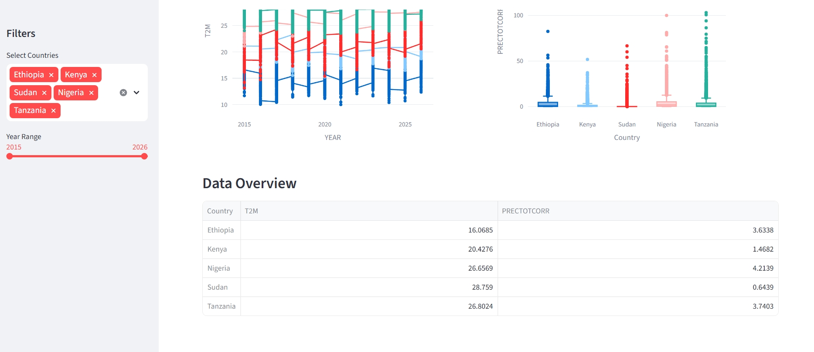

Climate Change Analysis: East & West Africa

This project provides a comprehensive analysis of climate trends across Ethiopia, Kenya, Sudan, Nigeria, and Tanzania to support policy development for COP32. It features a data-driven approach to identifying regional climate vulnerabilities and an interactive dashboard for real-time exploration.

 **Key Features**

Multi-Country Comparison: Integrated climate data across 5 African nations to identify regional risks.

Statistical Insights: Confirmed regional variance using One-Way ANOVA and Z-score anomaly detection.

Interactive Dashboard: Built with Streamlit to visualize temperature trends and rainfall volatility dynamically.

**Project Structure**

app/: Contains the Streamlit dashboard (main.py) and modular helper functions (utils.py).

notebooks/: Jupyter notebooks covering EDA, data cleaning, and statistical testing.

data/: Cleaned CSV datasets for each country.

scripts/: Python utility scripts for data processing and directory initialization.

**Setup & Installation**

Follow these steps to set up the project on your local machine:

Clone the repository:

git clone [https://github.com/Solih06/climate_change_week-0.git](https://github.com/Solih06/climate_change_week-0.git)
cd climate_change_week-0

Install dependencies:

pip install -r requirements.txt

Run the Dashboard:

streamlit run app/main.py

**Project Milestones**

1. Exploratory Data Analysis (EDA)

Cleaned NASA Power data by replacing sentinel values (-999) with NaNs.

Performed forward-fill imputation to handle missing time-series data.

Identified seasonal patterns (e.g., Ethiopia's Kiremt rainy season) and extreme weather anomalies.

2. Cross-Country Statistical Analysis

Synthesized data from five nations into a master analysis.

Conducted One-Way ANOVA ($p < 0.001$), identifying Sudan as the most thermally stressed region.

Analyzed rainfall variance to pinpoint flood-risk zones in Nigeria and Tanzania.

3. Interactive Visualization

Developed a Streamlit dashboard allowing users to filter by country and year range.

Integrated Plotly charts to visualize temperature spikes and rainfall distribution.

**Dashboard Preview**

Developed as part of the Climate Change Analysis Challenge (Week 0).

https://github.com/Solih06/climate_change_week-0/blob/main/Screenshot%202026-04-27%20at%2009-13-56%20Solih06_climate_change_week-0.png